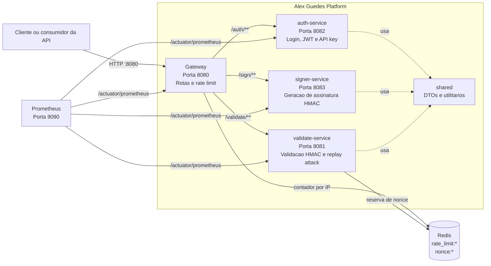

# Alex Guedes Platform

Plataforma multi-modulo em Java 21 com Spring Boot 3 criada para estudo de uma arquitetura parecida com producao. O projeto simula uma entrada unica via API Gateway, autenticacao, assinatura HMAC, validacao contra replay attack, armazenamento temporario no Redis e observabilidade com Prometheus.

O objetivo da aplicacao e mostrar como uma plataforma pode proteger chamadas entre cliente e API usando assinatura criptografica, `timestamp`, `nonce`, rate limit e metricas operacionais.

## Visao geral da arquitetura



## Modulos

- `gateway`: entrada unica da plataforma. Faz roteamento para os servicos internos e aplica rate limit por IP usando Redis.
- `auth-service`: registra usuarios, autentica credenciais com BCrypt, gera JWT, emite refresh tokens revogaveis e cria API keys persistidas apenas como hash.
- `signer-service`: gera uma assinatura HMAC SHA-256 para uma requisicao.
- `validate-service`: valida a chave do cliente, o timestamp, o nonce e a assinatura HMAC; tambem bloqueia replay attack usando Redis.
- `shared`: biblioteca interna com DTOs e utilitarios compartilhados pelos servicos.
- `infra`: Docker Compose, Redis e Prometheus.

Cada modulo possui um README proprio com detalhes de responsabilidade, endpoints, variaveis e comandos.

## Fluxo principal passo a passo

1. O cliente chama o `gateway` em `http://localhost:8080`.
2. O `gateway` aplica rate limit por IP. Por padrao, sao permitidas 60 requisicoes por janela de 1 minuto.
3. O primeiro usuario pode ser criado em `POST /auth/register` e recebe o papel `ADMIN`.
4. Para login, o cliente chama `POST /auth/login` com usuario e senha.
5. O `auth-service` valida as credenciais persistidas e retorna access token JWT e refresh token.
6. Para estudar o fluxo HMAC, o cliente chama `POST /sign` informando chave, segredo, metodo, caminho e corpo da requisicao.
7. O `signer-service` monta um payload canonico com metodo, path, hash do body, timestamp e nonce.
8. O `signer-service` assina esse payload com HMAC SHA-256 e retorna `timestamp`, `nonce` e `signature`.
9. O cliente chama `POST /validate` com os mesmos dados usados na assinatura e a assinatura retornada.
10. O `validate-service` confere se a chave e conhecida, se o timestamp esta dentro da janela permitida, se o nonce existe, se a assinatura e valida e se o nonce ainda nao foi usado.
11. Se tudo estiver correto, o `validate-service` grava `nonce:{key}:{nonce}` no Redis com TTL. Se o mesmo nonce for reutilizado, a chamada e rejeitada como replay attack.
12. O Prometheus coleta metricas dos servicos pelos endpoints `/actuator/prometheus`.

## Como subir com Docker

```powershell
cd C:\projetos2026\alexguedes-platform\infra
docker compose up --build
```

Servicos expostos:

- Gateway: `http://localhost:8080`
- Validate Service: `http://localhost:8081`
- Auth Service: `http://localhost:8082`
- Signer Service: `http://localhost:8083`
- Redis: `localhost:6379`
- Prometheus: `http://localhost:9090`

## Como compilar

```powershell
cd C:\projetos2026\alexguedes-platform
mvn clean package
```

Para compilar um modulo especifico com suas dependencias:

```powershell
mvn -pl validate-service -am clean package
```

## Endpoints principais via Gateway

### Login

```http
POST http://localhost:8080/auth/login
Content-Type: application/json
```

```json
{
  "username": "alex",
  "password": "strong-password"
}
```

### Renovar token

```http
POST http://localhost:8080/auth/refresh
Content-Type: application/json
```

```json
{
  "refreshToken": "rt_refresh-token-gerado"
}
```

### Logout

```http
POST http://localhost:8080/auth/logout
Content-Type: application/json
```

```json
{
  "refreshToken": "rt_refresh-token-gerado"
}
```

### Registrar usuario

```http
POST http://localhost:8080/auth/register
Content-Type: application/json
```

```json
{
  "username": "alex",
  "email": "alex@example.com",
  "password": "strong-password"
}
```

### Gerar API key didatica

```http
POST http://localhost:8080/auth/api-key
Authorization: Bearer jwt-gerado
Content-Type: application/json
```

```json
{
  "name": "portfolio-client"
}
```

### Gerar assinatura HMAC

```http
POST http://localhost:8080/sign
Content-Type: application/json
```

```json
{
  "key": "demo-key",
  "secret": "demo-secret",
  "method": "POST",
  "path": "/orders",
  "body": "{\"amount\":100}"
}
```

### Validar assinatura

Use o `timestamp`, `nonce` e `signature` retornados pelo `/sign`.

```http
POST http://localhost:8080/validate
Content-Type: application/json
```

```json
{
  "key": "demo-key",
  "method": "POST",
  "path": "/orders",
  "body": "{\"amount\":100}",
  "timestamp": 1714490000,
  "nonce": "nonce-retornado-pelo-sign",
  "signature": "assinatura-retornada-pelo-sign"
}
```

## Conceitos de producao estudados

- API Gateway como ponto unico de entrada.
- Roteamento para microservicos internos.
- Rate limit por cliente/IP.
- Autenticacao com JWT.
- Refresh token com rotacao e revogacao.
- API keys persistidas apenas como hash.
- Assinatura HMAC para integridade de requisicoes.
- Uso de `timestamp` para evitar assinaturas antigas.
- Uso de `nonce` para impedir reutilizacao da mesma assinatura.
- Redis como armazenamento rapido para dados temporarios.
- Actuator e Prometheus para observabilidade.
- Docker Compose para orquestrar ambiente local.

## Observacoes importantes

Este projeto e didatico. Para uma producao real, seria esperado evoluir pontos como persistencia de usuarios e clientes, armazenamento seguro de segredos, TLS, validacao real do JWT no gateway ou nos servicos, logs estruturados, traces distribuidos, testes automatizados e pipeline de CI/CD.
