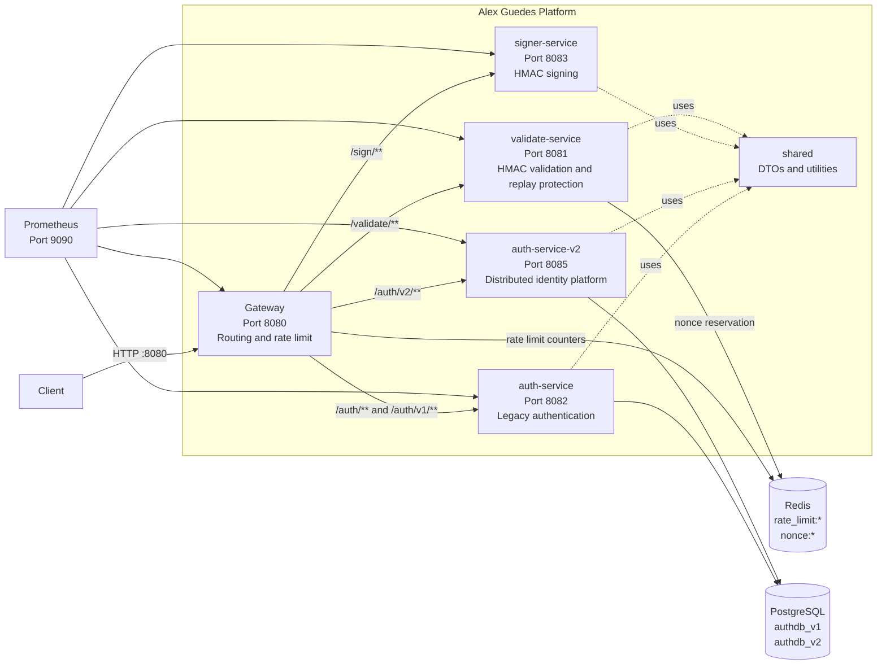

# Alex Guedes Platform

Java 21 and Spring Boot 3 multi-module platform built as a professional portfolio project. The platform explores API Gateway routing, identity, JWT authentication, API keys, HMAC request signing, replay attack protection, Redis-backed rate limiting, PostgreSQL persistence, Docker Compose and Prometheus observability.

The current direction is to evolve the project into a small distributed identity and request-trust platform.

## Architecture



## Modules

- `gateway`: central entry point. Routes traffic to internal services and applies Redis-backed rate limiting.
- `auth-service`: V1 authentication service. It supports user registration, BCrypt passwords, JWTs, refresh tokens and hashed API keys.
- `auth-service-v2`: identity platform foundation. It is being built around identity, credentials, RBAC, sessions, refresh token rotation, API key ownership and audit events.
- `signer-service`: creates HMAC SHA-256 signatures for request payloads.
- `validate-service`: validates HMAC signatures, timestamp skew and nonce replay protection.
- `shared`: shared DTOs and cryptographic utilities.
- `infra`: Docker Compose, Redis, PostgreSQL and Prometheus configuration.

## Gateway Routes

| Gateway route | Target | Notes |
| --- | --- | --- |
| `/auth/**` | `auth-service` | Legacy V1 route kept for compatibility. |
| `/auth/v1/**` | `auth-service` | Explicit V1 route, rewritten to `/auth/**`. |
| `/auth/v2/**` | `auth-service-v2` | V2 route, rewritten to `/auth/**`. |
| `/sign/**` | `signer-service` | HMAC signature generation. |
| `/validate/**` | `validate-service` | HMAC validation and replay protection. |

## Local Docker Environment

```powershell
cd C:\projetos2026\alexguedes-platform\infra
docker compose up --build
```

Exposed services:

- Gateway: `http://localhost:8080`
- Validate Service: `http://localhost:8081`
- Auth Service V1: `http://localhost:8082`
- Signer Service: `http://localhost:8083`
- Auth Service V2: `http://localhost:8085`
- Redis: `localhost:6379`
- PostgreSQL: `localhost:5432`
- Prometheus: `http://localhost:9090`

PostgreSQL is initialized with two databases:

- `authdb_v1`
- `authdb_v2`

## Build

```powershell
cd C:\projetos2026\alexguedes-platform
mvn clean package
```

Build a single module with its dependencies:

```powershell
mvn -pl auth-service-v2 -am test
```

## Main Flows

### Identity Flow

1. V1 currently supports registration, login, refresh token rotation, logout and API key creation.
2. V2 now has its domain and database foundation for identity, credentials, roles, permissions, sessions, refresh tokens, API keys and audit events.
3. The next V2 implementation step is to add repositories, use cases and HTTP endpoints.

### HMAC Flow

1. The client prepares request data: method, path, body, timestamp and nonce.
2. `signer-service` creates the canonical payload and signs it with HMAC SHA-256.
3. `validate-service` recalculates the signature, checks timestamp skew and reserves the nonce in Redis.
4. Reusing the same nonce is rejected as a replay attack.

## Production Concepts Covered

- API Gateway as a single entry point.
- Redis-backed rate limiting.
- JWT authentication.
- Refresh token rotation and session revocation.
- API keys stored as hashes.
- RBAC domain modeling.
- Audit event domain modeling.
- HMAC request signing.
- Timestamp and nonce replay protection.
- PostgreSQL persistence with Flyway migrations.
- Prometheus metrics.
- Docker Compose for local orchestration.

## Current Status

This is a portfolio project moving toward production-like design. The V1 auth service is functional and the V2 identity service now has its persistence/domain foundation. The next professional milestones are:

- Implement V2 repositories and application services.
- Add `register`, `login`, `refresh`, `logout`, `/auth/me` and API key endpoints in V2.
- Add JWT validation filters and authorization rules.
- Add audit writing in every security-sensitive flow.
- Add integration tests for the V2 use cases.
